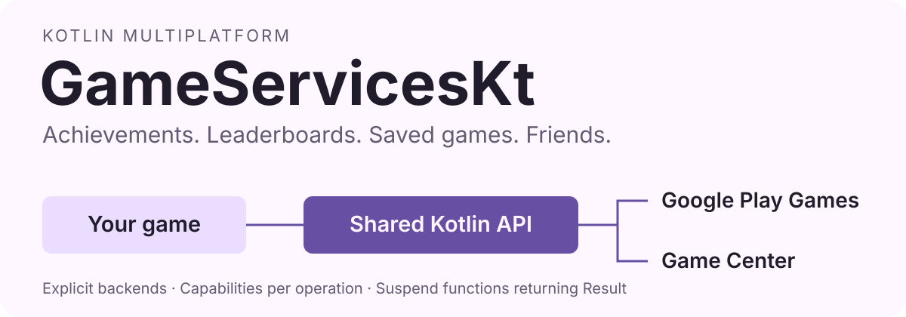
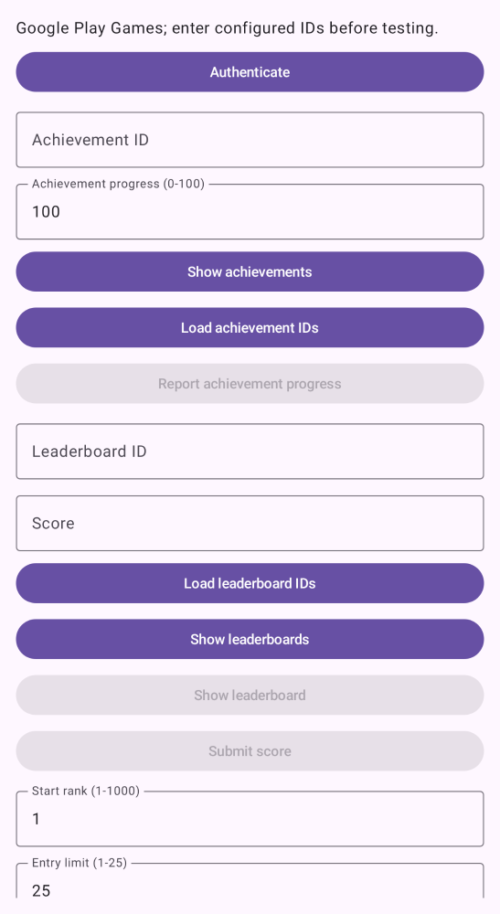

<h1 align="center">GameServicesKt</h1>

<p align="center">Kotlin Multiplatform, provider-neutral game-services APIs for Google Play Games and Game Center.</p>

<p align="center">
  <a href="https://github.com/mikepenz/GameServicesKt/actions/workflows/ci.yml"></a>
  <a href="#modules"></a>
  <a href="LICENSE"></a>
</p>

<p align="center">
  <picture>
    <source media="(prefers-color-scheme: dark)" srcset="assets/readme/hero-dark.svg">
    
  </picture>
</p>

<p align="center">
  <a href="#quickstart">Quickstart</a> ·
  <a href="#sample-app">Sample app</a> ·
  <a href="PLATFORM_SUPPORT.md">Platform support</a> ·
  <a href="#reference">Reference</a>
</p>

| In your game | Shared API |
| --- | --- |
| Sign-in and account changes | `GameServices` with observable `authenticationState` |
| Achievement progress | `AchievementsClient` with shared-to-provider ID mappings |
| Score submission and queries | `LeaderboardsClient` with rank, scope, and period controls |
| Saved games | `SavedGamesClient` with opaque bytes and explicit conflict resolution |
| Friends and profiles | `SocialClient` with permission and capability checks |

Choose your backend at the app boundary, then pass the service interfaces into shared code.
Each client exposes `supportedOperations`; check it before offering an action.
Android and Apple backends have different capabilities. See the [platform matrix](PLATFORM_SUPPORT.md)
for target coverage, experimental adapters, and live-validation requirements.

## Quickstart

### 1. Add the features you need

Add the [snapshot repository](#modules) to dependency resolution, then declare contracts in
`commonMain` and provider adapters in the corresponding platform source sets. For achievements:

```kotlin
kotlin {
    sourceSets {
        commonMain.dependencies {
            implementation("com.mikepenz:game-services-achievements:0.1.0-SNAPSHOT")
        }
        androidMain.dependencies {
            implementation("com.mikepenz:game-services-play-games-achievements:0.1.0-SNAPSHOT")
        }
        iosMain.dependencies {
            implementation("com.mikepenz:game-services-game-center-achievements:0.1.0-SNAPSHOT")
        }
    }
}
```

Each feature adapter brings its backend core and matching contract transitively.
Add leaderboard, saved-game, and social artifacts only when your game uses them.

### 2. Create one backend and its clients

Complete [Android setup](#android-setup) or [iOS setup](#ios-setup) first.
On Android, create clients in your `ComponentActivity.onCreate`, before it starts:

```kotlin
import com.mikepenz.gameservices.playgames.PlayGamesBackend
import com.mikepenz.gameservices.playgames.createAchievementsClient

val backend = PlayGamesBackend(this)
val achievements = backend.createAchievementsClient()
```

On iOS, keep one backend for the app and supply its current presenter:

```kotlin
import com.mikepenz.gameservices.gamecenter.GameCenterBackend
import com.mikepenz.gameservices.gamecenter.createAchievementsClient

val backend = GameCenterBackend { currentViewController }
val achievements = backend.createAchievementsClient()
```

Pass `backend` as `GameServices` and `achievements` as `AchievementsClient` to shared code.
Call `refreshAuthentication()` from a coroutine at startup and handle its `Result`.

### 3. Call the shared API

For example, call this suspending function from a player's sign-in action and display its result:

```kotlin
import com.mikepenz.gameservices.GameServices

suspend fun signIn(services: GameServices): String =
    services.authenticate().fold(
        onSuccess = { player -> "Signed in as ${player.displayName}" },
        onFailure = { error -> "Could not sign in: ${error.message}" },
    )
```

Observe `authenticationState` for later account changes. Feature operations also return `Result`;
handle failures and check [operation support](#modules) before displaying controls.

## Sample app

The Android and iOS validation hosts render the same Compose Multiplatform screen.
Use it to exercise authentication, achievements, leaderboards, saves, and friends with your own
provider configuration. See [host setup](#provider-validation-host).

<p align="center">
  
</p>

`GameServicesSamplePreview()` renders the shared sample UI. This is a deterministic preview,
not a signed-in provider session. [Preview source](sample-host-android/src/main/kotlin/com/mikepenz/gameservices/sample/host/GameServicesSamplePreview.kt)
· [Shared screen](sample/src/commonMain/kotlin/com/mikepenz/gameservices/sample/GameServicesSample.kt).

The image links directly to the tracked Paparazzi baseline. To refresh it after a UI change,
run `./gradlew :sample-host-android:recordPaparazziDebug`, review the image, and commit the baseline.
CI checks it with `./gradlew :sample-host-android:verifyPaparazziDebug`.

---

## Reference

| Topic | Details |
| --- | --- |
| [Modules](#modules) | Artifacts, snapshot repository, capabilities, and shared usage |
| [Android setup](#android-setup) · [iOS setup](#ios-setup) | Provider configuration and client creation |
| [Additional platforms](#additional-platforms-and-runtimes) | Desktop, other Apple targets, and experimental adapters |
| [Authentication](#authentication) · [Shared IDs](#shared-service-ids) | Session ownership and provider ID mappings |
| [Operation contracts](#operation-contracts) | Lifecycles, cancellation, acknowledgements, and errors |
| [Leaderboard queries](#leaderboard-queries) | Ranking, pagination, and privacy |
| [Saves and friends](#saved-games-and-friends-setup) | Conflicts, iCloud, and consent |
| [Validation hosts](#provider-validation-host) · [Validation limits](#validation-limits) | Local setup and live-provider checks |
| [Snapshot migration](#snapshot-migration-explicit-backends) | Moving to explicit provider backends |

## Modules

```kotlin
implementation("com.mikepenz:game-services-core:0.1.0-SNAPSHOT")
implementation("com.mikepenz:game-services-achievements:0.1.0-SNAPSHOT")
implementation("com.mikepenz:game-services-leaderboards:0.1.0-SNAPSHOT")
implementation("com.mikepenz:game-services-saved-games:0.1.0-SNAPSHOT")
implementation("com.mikepenz:game-services-social:0.1.0-SNAPSHOT")
```

Snapshot builds require the Central Portal snapshot repository:

```kotlin
repositories {
    maven("https://central.sonatype.com/repository/maven-snapshots/") {
        content { includeGroup("com.mikepenz") }
    }
    mavenCentral()
}
```

The five modules above contain provider-neutral contracts. Add the backend feature artifacts
for the features your app uses. For example, Android achievements require
`game-services-play-games-core` and `game-services-play-games-achievements`; Game Center uses
`game-services-game-center-core` and `game-services-game-center-achievements`.
Use the same `0.1.0-SNAPSHOT` version for all artifacts.

Backends are selected explicitly at the app edge. Kotlin target and provider are separate:
a JVM client can use a native backend where one is available. No backend is selected or switched
automatically. For an intentionally disabled client use `createUnsupportedGameServices(target)`
and the corresponding `createUnsupported…Client(target)` factories.

Each client exposes `supportedOperations`. Check the specific operation before displaying a
control; a backend may support achievement data while lacking provider-owned UI. `isSupported`
only indicates that some feature operations exist. Authentication and permission failures remain
separate from capability reporting.

Wire the platform client at the app edge, then pass `GameServices` and feature clients into shared
code. Do not treat `PlayerId` as an in-game account ID; it is scoped to the provider.

```kotlin
import com.mikepenz.gameservices.GameServices
import com.mikepenz.gameservices.GameServicesException
import com.mikepenz.gameservices.achievements.AchievementsClient
import com.mikepenz.gameservices.leaderboards.LeaderboardId
import com.mikepenz.gameservices.leaderboards.LeaderboardsClient

class GameServicesScreen(
    private val services: GameServices,
    private val achievements: AchievementsClient,
    private val leaderboards: LeaderboardsClient,
) {
    suspend fun signInAndShowAchievements(): String {
        if (!services.support.isSupported) return "Game services are unavailable on this platform"
        return services.authenticate().fold(
            onSuccess = { player ->
                achievements.showAchievements()
                    .onFailure { return "Could not open achievements: ${it.message}" }
                "Signed in as ${player.displayName}"
            },
            onFailure = { "Could not sign in: ${it.message}" },
        )
    }

    suspend fun submitScore(id: LeaderboardId, score: Long): Result<Unit> =
        if (services.support.isSupported) leaderboards.submitScore(id, score)
        else Result.failure(GameServicesException.UnsupportedTarget(services.support.target))
}
```

Every service operation returns `Result`; handle its failure instead of assuming authentication. Value constructors validate inputs and may throw `IllegalArgumentException`. A
`PlayerId` identifies a player only inside its provider, so map it to your own account ID rather
than storing it as an application-wide identifier.

## Android setup

Set the consumer app's `minSdk` to 30. Configure the game in Play Console, add its Games services
project ID to app resources, and reference it from the consumer app manifest:

```xml
<application>
    <meta-data
        android:name="com.google.android.gms.games.APP_ID"
        android:value="@string/game_services_project_id" />
</application>
```

Create the Android client from the lifecycle-owned `ComponentActivity` during `onCreate`, before
activity-result registration closes:

```kotlin
val backend = PlayGamesBackend(this)
val services: GameServices = backend
val achievements = backend.createAchievementsClient()
```

## iOS setup

Enable the Game Center capability in Xcode (which adds the entitlement), configure the app and
requested achievements/leaderboards in App Store Connect, and create the client with a current
presenter:

```kotlin
val backend = GameCenterBackend { currentViewController }
val services: GameServices = backend
val achievements = backend.createAchievementsClient()
```

## Additional platforms and runtimes

Android on ChromeOS and Google Play Games for PC uses `PlayGamesBackend` from the Android
artifact. Game Center also provides macOS, tvOS, watchOS, and macOS JVM variants. On macOS JVM,
construct `GameCenterBackend()` explicitly and close it when the Compose Desktop host exits.
Use the same Game Center feature artifact names; Gradle selects the JVM variant.

Experimental adapters require `@OptIn(ExperimentalGameServicesApi::class)`:

- `game-services-play-games-native`: Android Kotlin/Native C SDK, boolean authentication,
  achievements, and Recall; the host supplies its Activity/JavaVM.
- `game-services-play-games-pc`: Windows x64 JVM/Native SDK, initialization and Recall;
  the host packages its native DLLs and supplies an absolute path.
- `game-services-recall`: the opaque server-facing Recall session contract.

These Google SDKs expose different feature sets. Recall is not player authentication.
See [the platform matrix and host setup](PLATFORM_SUPPORT.md) for supported operations,
native packaging, signing, and the distinction between compile checks and live validation.

## Authentication

Call `refreshAuthentication()` once at app startup after creating the client. On Android it checks
the Play Games automatic-authentication result without starting the explicit sign-in flow. On iOS it
initializes Game Center and may receive a system view controller that the library presents.

Call `authenticate()` only from a player action. It starts the explicit Play Games sign-in flow on
Android. Game Center has no separate retry API. The iOS client installs its handler once, keeps observing account changes, and rechecks the current player on later calls. Create one iOS core client for the app.
Derive a boolean from `authenticationState.value is AuthenticationState.Authenticated`; the state
flow remains the single source of truth.

## Shared service IDs

Google Play Games uses opaque achievement and leaderboard IDs while Game Center IDs are app-defined.
Pass immutable mappings to the feature factories when shared game code should use one ID on both
platforms. Calls translate the shared ID to the provider ID; loaded achievement and leaderboard
metadata translates back to the shared ID.

```kotlin
import com.mikepenz.gameservices.achievements.AchievementId
import com.mikepenz.gameservices.achievements.AchievementIdMapping
import com.mikepenz.gameservices.achievements.AchievementIdMappings

val achievementIds = AchievementIdMappings.of(
    AchievementIdMapping(
        id = AchievementId("dragon_slayer"),
        googlePlayGamesId = AchievementId("CgkI..."),
        gameCenterId = AchievementId("dragon_slayer"),
    ),
)

// Android
val achievements = backend.createAchievementsClient(achievementIds)

// iOS
val achievements = backend.createAchievementsClient(achievementIds)
```

`LeaderboardIdMappings` works the same way. IDs absent from a mapping pass through unchanged.

Provider UI can be launched only from a user action. Handle every `Result`; cancellation stays a
cancelled coroutine, while expected service failures remain typed `GameServicesException` values.

## Operation contracts

Keep Android clients with the `ComponentActivity` that created them. Recreate them during the new
activity's `onCreate`; do not store an old activity client in an application singleton. Register every
feature factory before the activity starts. Coroutine cancellation does not dismiss an already opened
provider screen. A second selection or consent request fails while that screen is still outstanding;
its late result is discarded for the cancelled caller. Destroying the activity cancels the outstanding
wait. Provider UI methods switch to the main thread internally.

Score submissions and achievement updates wait for provider acknowledgement. A successful result
does not guarantee immediate visibility in a later leaderboard query or on another device. Handle
offline failures and choose an application-owned retry policy. Save commits acknowledge local commit
and requested background synchronization on Android; they do not confirm remote synchronization.
Cancelling a save cannot undo a commit that has already started. Native save commit and cleanup finish
before releasing the operation's resources.

`AuthenticationRequired`, `PermissionRequired`, `ConfigurationMissing`, and `UserCancelled` represent
recognized provider failures. Other failures carry a provider and code. JVM provider exceptions retain
the original cause for diagnostics. `InternalGameServicesApi` marks implementation helpers shared by
the published modules; applications should use the service interfaces instead.

## Leaderboard queries

`LeaderboardScore.player` is nullable for an anonymous or privacy-restricted player. Use
`displayName` for presentation. `rank` is a nullable `Long`; null means the provider did not return a
positive rank. Never manufacture a player ID for anonymous scores.

Queries start at ranks 1 through 1000 and return at most 25 entries. The limit counts entries, including
ties. Android reads successive SDK pages and scans at most 41 pages, then returns a failure instead
of silently returning an incomplete result. Use the native leaderboard screen for deeper browsing or
boards with enough ties to exhaust this limit. These bounds avoid unbounded sequential provider calls.

## Saved games and friends setup

Use 1–100 ASCII letters, digits, or `-._~` for portable saved game IDs. Android enforces this filename subset; iOS can still read existing saves with other nonempty names.
Android validates bytes against the SDK's maximum data size before opening a save. Keep payloads small
and handle provider-specific limits and quota failures. The library copies bytes at public boundaries;
it does not own your serialization or compression format.

Handle `Conflict` on both reads and writes. Inspect every version, then call `resolve(conflict.id, data)`
with chosen or merged bytes on the same client. Android reopens the save before resolving and returns
a fresh conflict if it changed. After process/activity recreation or an unknown-conflict error, read
again. A failed resolution can be retried, but cancellation or an ambiguous network failure should be
followed by readback before another write.

For iOS saves, enable iCloud Documents, configure the ubiquity container and matching entitlements,
and test with iCloud Drive enabled. Game Center authentication alone does not configure cloud saves.
For friends, add a localized `NSGKFriendListUsageDescription` to the app's `Info.plist`, then call
`requestFriendsAccess()` from a user action. `loadFriends()` does not silently request consent.
Android loads all available friend pages. iOS avatar/profile lookup resolves the supplied Game Center
player identifier directly instead of restricting it to the current friend list; provider privacy
restrictions still apply.

## Provider-validation host

`:sample-host-android` and `sample-host-ios` are private, non-published validation apps.
Both hosts render the same Compose Multiplatform screen from `:sample`. Feature-client capability
flags disable unavailable actions, including provider-owned save selection on iOS.

Android setup:

1. Create a private Play Games Services project linked to `com.mikepenz.gameservices.sample.host`.
   Add every testing account under PGS **Testers**; no production release is needed.
2. Put the numeric PGS Project ID (not the OAuth client ID) in the ignored root `local.properties`:
   `gameServicesProjectId=123456789012`. If using the local demo keystore, add its password as
   `demoKeystorePassword=...`. This is local, so forks supply their own project and keystore.
3. Create a PGS credential for the certificate that signs the debug APK. Also add the Google Play
   app-signing SHA-1 only when testing an internal-track build. Run
   `./gradlew :sample-host-android:installJavaSdkDebug` on an API 30+ device for the Java SDK,
   or `./gradlew :sample-host-android:installNativeSdkDebug` for the C SDK. Both flavors use the
   same package, project ID, and signing certificate, so install one at a time with the same PGS
   tester account. The native flavor needs a Linux build host with Android NDK and CMake; its
   Kotlin/Native linker cannot run on Apple Silicon without Rosetta. For 16 KB validation, use a
   `google_apis_playstore_ps16k` system image; the `google_apis_ps16k` image has no Play Store.

The native flavor calls `NativePlayGamesBackend` through JNI. Open the backend, then check
authentication, sign in, load achievements, report progress with a configured achievement ID,
show the provider achievements screen, and request a Recall session. The screen confirms that
Recall returned a session but does not display the token. Close the Activity and reopen it to
check session cleanup. This exercises the C SDK against a real provider account. The C SDK beta
does not expose leaderboards, saved games, social features, or player identity, so those actions
remain in the Java flavor.

Open `sample-host-ios/GameServicesSampleHost.xcodeproj` in Xcode, copy `Config.xcconfig` to the
ignored `Local.xcconfig`, and set its development team, bundle ID, and iCloud container before
running on an iOS 16+ device. Select a sandbox Game Center account; App Store Connect
configuration remains app-owned.

The validation screen refreshes authentication on startup, observes account changes, prevents
concurrent operations, and preserves editable fields up to 16,384 characters each across activity recreation.
Larger fields are omitted from restored state with a warning; read the save again before writing.
The full payload remains available while the screen is open. It can query scores,
read the current player's score, and inspect or edit UTF-8 save/conflict payloads. Re-read conflicts
after recreating a client; session conflict handles are deliberately not restored.

## Validation limits

Automated regressions cover shared contracts and pagination, Android achievement loading and update
acknowledgements, Android sign-in and GameKit callback sequences, provider error mappings, and snapshot
commit/cancellation/descriptor cleanup. Saved-game conflict tests run the real Android and iOS adapters
against controlled native responses: choosing either version, supplying merged/empty/binary data,
changing or repeated conflicts, failed resolutions and retries, stale handles, cancellation, and cleanup.
Google's pair-and-token contract and GameKit's same-name version lists have separate fixtures.
The library preserves opaque bytes; games provide their own merge policy.
The sample integration test drives startup, failure recovery, conflict editing/resolution, and account changes through the app.

Live provider acceptance still requires configured Android and iOS devices: sign-in and account changes, consent cancellation,
score visibility, offline writes, and actual cross-device synchronization. Deterministic adapter tests
validate conflict handling without creating live backend conflicts; device tests check that the provider
and account configuration behave as expected. Device frame time, allocation,
and network latency measurements are separate from these tests.

## Snapshot migration: explicit backends

Platform factories moved out of contract modules. Import Android factories and `PlayGamesBackend`
from `com.mikepenz.gameservices.playgames`, or Game Center factories and `GameCenterBackend` from
`com.mikepenz.gameservices.gamecenter`. Create one backend, then call its feature factory extensions.
Construct Android UI clients during `onCreate` before Activity result registration closes.

Feature suffixes are `core`, `achievements`, `leaderboards`, `saved-games`, and `social`.
A backend feature artifact brings its matching contract and backend core transitively; unused
feature adapters do not need to be installed. Existing ID mappings and suspend feature contracts
remain available. Old implicit platform factories have been removed from this snapshot.

See [platform support and live validation](PLATFORM_SUPPORT.md) for Apple targets, partial capabilities, and Android deployment environments.
